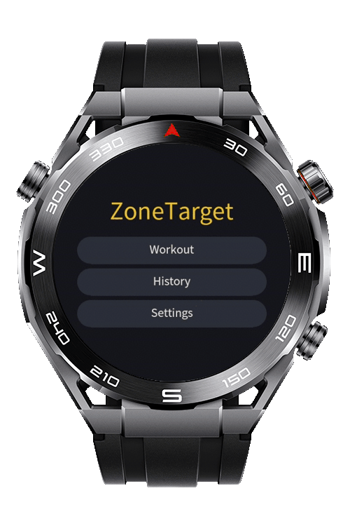
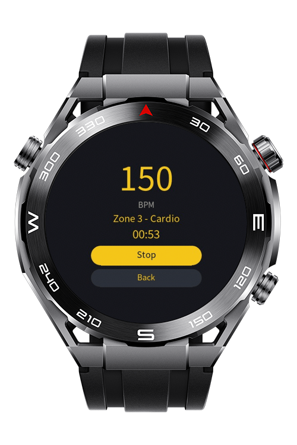
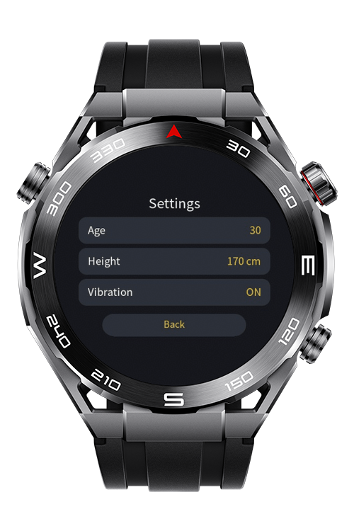

> **Note:** To access all shared projects, get information about environment setup, and view other guides, please visit [Explore-In-HMOS-Wearable Index](https://github.com/Explore-In-HMOS-Wearable/hmos-index).

# ZoneTarget

**ZoneTarget**  is a comprehensive exercise app on lite wearable ecosystem which users can track zones according to their real-time bpm data, measure their steps, distance and send exercise summaries to phone by wearengine.

# Preview

<div>
    
    
    
</div>

# Use Cases
 
- Measure real time bpm, step count and distance.
- Measurement of bpm and calculation of heart rate zones.
- All in one exercise tracking app on lite wearable devices with various features.
- App gives users vibrate feedback when the current zone changes.
- Send training summary data from watch to phone using wearengine.

# Tech Stack

**Languages**: JS, HML, CSS  
**Frameworks**: HarmonyOS SDK 6.0.0(20)  
**Tools**: DevEco Studio Version 6.1.1.280  
**Libraries/Kits**:

- @ohos.router
- @system.sensor
- @system.vibrator
- @system.file
- @system.storage
- @system.wearengine

## Documentation Link

- [Applying for the Wear Engine Service](https://developer.huawei.com/consumer/en/doc/connectivity-Guides/applying-wearengine-0000001050777982)
- [Wear Engine SDK](https://developer.huawei.com/consumer/en/doc/connectivity-Library/litewearable-sdk-cn-0000001705004353)
- [Lite Wearable App Development via Wear Engine](https://developer.huawei.com/consumer/en/doc/connectivity-Guides/fitnesswatch-dev-0000001051423561)

# Directory Structure

```
└── main
    └── js
        └── MainAbility
            └── common
                ├── DistanceUtil.js
                ├── FeedbackService.js
                ├── HistoryService.js
                ├── StorageService.js
                ├── WearEngineService.js
                ├── ZoneCalculator.js
            └── constants
                ├── constants.js
            └── i18n
                ├── en-US.json
                ├── zh-CN.json
            └── pages
                └── detail
                    ├── detail.css
                    ├── detail.hml
                    ├── detail.js
                └── history
                    ├── history.css
                    ├── history.hml
                    ├── history.js
                └── index
                    ├── index.css
                    ├── index.hml
                    ├── index.js
                └── setting-age
                    ├── setting-age.css
                    ├── setting-age.hml
                    ├── setting-age.js
                └── setting-height
                    ├── setting-height.css
                    ├── setting-height.hml
                    ├── setting-height.js
                └── settings
                    ├── settings.css
                    ├── settings.hml
                    ├── settings.js
                └── workout
                    ├── workout.css
                    ├── workout.hml
                    ├── workout.js
            └── wearenginesdk
                ├── wearengine.js
            ├── app.js
    └── resources
        └── base
            └── element
                ├── string.json
            └── media
                ├── icon_small.png
                ├── icon.png
        └── rawfile
    └── config.json
```

# Constraints and Restrictions

## Permissions

After installation of application, permissions must be granted from Settings -> Permission manager.
1. **ohos.permission.READ_HEALTH_DATA**
2. **ohos.permission.ACTIVITY_MOTION**
3. **ohos.permission.VIBRATE**

## Supported Device
This app works on real device.

- Huawei Sport (Lite) Watch GT 4/5/6
- Huawei Sport (Lite) GT5/6 Pro
- Huawei Sport (Lite) Fit 3/4 & Fit 4 Pro
- Huawei Sport (Lite) D2
- Huawei Sport (Lite) Ultimate 1

# License

**ZoneTarget** is distributed under the terms of the **MIT License**.  
See the [LICENSE](LICENSE) file for more information.  